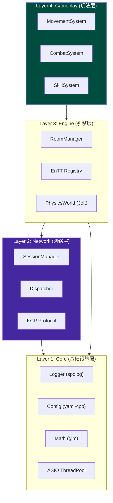
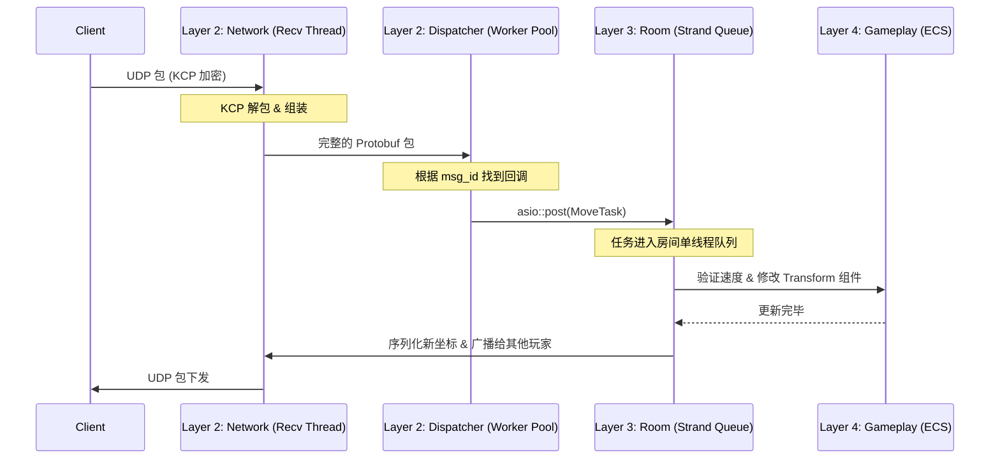

# 项目架构与设计规范 (Architecture & Design)

本文档旨在说明 `cpp-server` 项目的整体架构、技术选型以及后续演进路线，作为开发过程中的最高指导原则，防止代码腐化和重复造轮子。

## 1. 架构评估：保留现有 C++ 架构

**结论**：**当前架构非常合理且专业，强烈建议保留，不建议迁移至 Qt。**

- **技术栈优势**：目前采用的 **ASIO (网络 I/O) + KCP (可靠传输) + Protobuf (协议) + 多线程池** 是 C++ 后端高性能服务的“黄金标准”。
- **性能对比**：
  - **当前架构**：直接操作 Socket，无额外封装开销，并发模型自由定制（如已实现的 `SessionManager` 分片锁），适合高频 UDP 包处理。
  - **Qt 网络框架**：虽然易用，但 Signal/Slot 机制在高频（每秒数千/万包）场景下会成为 CPU 瓶颈；且 Qt 依赖库庞大，不适合追求极致轻量化的战斗服务器。

## 2. 语言分工：C++ 与 Golang 的微服务联动

采用 **C++ (核心战斗)** + **Golang (外围业务)** 的混合架构是业界主流方案（如腾讯、网易大型项目）。

### 2.1. C++ Server (cpp-server)

**定位**：**CPU 密集型 + 强实时**。负责游戏内的每一帧计算。

- **核心战斗循环 (Tick Loop)**：维持固定帧率（如 60Hz/128Hz）的逻辑驱动。
- **物理与碰撞**：
  - **射线检测 (Raycast)**：用于判定远程武器（狙击、步枪）是否命中。
  - **碰撞检测 (Collision)**：用于处理近战攻击、手雷爆炸范围、角色移动阻挡。
- **网络同步**：
  - **状态同步/帧同步**：计算服务器权威状态，通过 KCP 下发 Snapshot 或 Delta。
  - **延迟补偿 (Lag Compensation)**：**FPS 核心**。回滚世界状态历史快照，解决高 Ping 玩家“瞄准了打不中”的问题。
- **视野管理 (AOI)**：计算九宫格/四叉树，只向玩家同步其视野范围内的实体（吃鸡大地图必备）。

### 2.2. Golang Server (go-server)

**定位**：**I/O 密集型 + 弱实时**。负责与数据库、Web 前端交互。

- **接入层**：账号注册、登录鉴权 (HTTP/HTTPS)、JWT Token 生成。
- **匹配系统 (Matchmaking)**：基于 ELO 分数的匹配池，组队逻辑。
- **社交系统**：好友、聊天、公会、排行榜。
- **经济系统**：商城购买、背包管理、皮肤库存（读写 MySQL/Redis）。
- **资源调度**：当匹配成功后，通过 RPC 通知 C++ Server 创建房间，并将玩家分配过去。

**通信方式**：内网服务间推荐使用 **gRPC** 或 **Redis Pub/Sub**。

## 3. 模块化与扩展性分析

当前项目在**底层网络层**做得很好，但**游戏业务层**尚属空白，需要进行模块化扩展。

- **现状 (网络层)**：
  - `SessionManager`：通过 `Lock Sharding` (分片锁) 实现了优秀的会话管理。
  - `Dispatcher`：实现了消息路由解耦。
- **待扩展 (业务层)**：
  - **Room/Match Manager**：目前所有包混在一起处理。需要引入 `Room` 概念，支持单进程承载多个对局，实现对局隔离。
  - **ECS (Entity-Component-System)**：强烈建议引入 ECS 架构（如 `entt` 库）替代传统的 OOP 继承，用于管理成百上千的玩家、子弹、载具实体，提升缓存命中率和性能。
  - **Physics Adapter**：接入物理引擎（如 PhysX, Bullet, Jolt），用于服务端的高效场景查询。

## 4. 核心业务演进路线 (Roadmap)

建议按以下优先级逐步迭代 C++ 服务器功能：

| 优先级          | 模块                  | 描述                                            |
| :----------- | :------------------ | :-------------------------------------------- |
| **P0 (MVP)** | **GameLoop & Room** | 实现固定频率 (e.g. 60Hz) 的 `Update` 循环；实现房间创建/销毁逻辑。 |
| **P0 (MVP)** | **基础移动同步**          | 处理 `(x,y,z,yaw)` 输入，服务器验证速度（防加速挂），广播状态。       |
| **P0 (MVP)** | **地图数据加载**          | 解析客户端导出的地图碰撞数据 (NavMesh/Collision Mesh)。      |
| **P1 (核心)**  | **延迟补偿**            | 实现 `LagCompensation` 系统，记录过去 N 帧的实体位置快照。      |
| **P1 (核心)**  | **射击判定**            | 实现 Hitscan (射线) 和 Projectile (抛物线) 伤害计算。      |
| **P2 (进阶)**  | **AOI 视野管理**        | 优化大地图同步量，仅同步关注区域。                             |
| **P2 (进阶)**  | **反作弊校验**           | 增加移动路径合理性检查、射击角度检查等服务端校验。                     |

## 5. 性能评估

- **网络 I/O**：**极高**。ASIO 异步模型 + 多线程 Worker 能轻松跑满网卡，不是瓶颈。
- **并发锁**：**极优**。`SessionManager` 的分片锁设计极大降低了多线程竞争。
- **潜在瓶颈**：
  1. **物理计算**：大量的 Raycast 是 CPU 杀手。建议物理查询并行化。
  2. **序列化**：Protobuf 序列化在海量小包（移动同步）下有 CPU 开销。建议对高频移动包进行字段压缩（如 float 转 int16）。

## 6. 工程化与运维补充建议

为了更好地落地该项目，补充以下工程化建议：

1. **统一构建环境 (Docker)**：
   - C++ 依赖管理（ASIO, Protobuf, KCP, 物理引擎）较复杂。建议制作统一的 Docker 编译镜像，确保开发机、CI/CD 和生产环境一致。
2. **协议管理流程**：
   - 建立独立的 `protocol` git 仓库。
   - 统一管理 `.proto` 文件，使用脚本自动生成 C++ (`.pb.cc`) 和 Golang (`.pb.go`) 代码，确保两端协议严格一致。
3. **日志与监控**：
   - **日志**：C++ 侧引入异步日志库（如 `spdlog`），避免磁盘 I/O 阻塞战斗线程。
   - **监控**：接入 Prometheus + Grafana。关键指标：`Tick耗时` (必须小于 16ms/33ms)、`KCP重传率`、`在线房间数`、`内存占用`。
4. **配置管理**：
   - 完善 `config.h`，支持从 YAML/JSON 加载配置。
   - 支持热加载配置（如调整武器伤害数值），无需重启服务器。

## 7. 高效测试工具链：KcpProbe 与 Unity 协同开发

鉴于 Unity 测试流程繁琐（启动慢、编译久），**强烈建议**采用“工具先行”的开发模式。你已经拥有一套完美的工具链：**cpp-server (后端) + KcpProbe (调试终端/协议验证) + Unity (最终表现)**。

### 7.1. Kcp.Core：纯 C# 网络层复用

- **无缝移植**：`KcpProbe` 项目中的 `Kcp.Core` 模块（包含 `KcpClient.cs`, `PacketDispatcher.cs`, `Proto/Base.cs`）是纯粹的 .NET Standard 代码，**完全不依赖 WinUI**。
- **Unity 集成**：直接将整个 `Kcp.Core` 文件夹复制到 Unity 项目的 `Assets/Scripts/Network` 目录下。
- **极简调用**：在 Unity 中只需编写一个 `MonoBehaviour` 脚本，在 `Start()` 中调用 `KcpClient.ConnectAsync` 即可实现与服务器的连通，无需重复造轮子。

### 7.2. KcpProbe：作为核心“游戏控制台”

- **开发策略**：随着服务器功能增加（如登录、移动同步），**不要**优先在 Unity 里写 UI 测试。
- **操作建议**：
  1. **优先实现**：开发新协议（例如“移动同步”）时，先在 `KcpProbe` 中添加一个测试按钮或页签。
  2. **模拟逻辑**：编写简单的逻辑（如每 100ms 发送一个随机坐标包）来模拟游戏行为。
  3. **验证闭环**：通过 `KcpProbe` 的日志和图表确认服务器能正确解析、处理并广播数据后，再去 Unity 中接入摇杆/键盘控制。
- **核心理由**：WinUI 支持 XAML 热重载，修改界面仅需几秒；而 Unity 修改脚本编译往往需要几十秒。这种\*\*“KcpProbe 验证逻辑 -> Unity 接入表现”\*\*的工作流能提升 10 倍开发效率。

### 7.3. 自动化回归测试 (SmokeTests)

- **现状**：`winui-demo` 解决方案中已包含 `Kcp.SmokeTests` 项目，这是自动化测试的雏形。
- **价值**：C++ 服务器逻辑修改（如重构 `SessionManager` 或优化 KCP 参数）极易引入回归 Bug。
- **执行**：每次修改 C++ 核心代码后，务必运行一次 `SmokeTests`。它能自动模拟客户端连接、发送 RPC 并验证返回值，确保服务器“没被改挂”，为高频迭代提供安全网。

### 7.4. 为什么不推荐 Web 测试客户端？

- **浏览器限制**：Web 浏览器禁止网页直接访问 UDP Socket，必须通过 WebRTC（ICE/STUN/DTLS）实现，这会极大增加 C++ 服务器的复杂度。
- **代码无法复用**：Web 端需使用 TS/JS 实现协议栈，无法直接复用于 Unity (C#)，导致双倍开发工作量。
- **二进制处理困难**：在 JS 中处理 Protobuf 二进制流和 64 位整数不如 C# 便捷。
- **结论**：**WinUI (C#) 才是真正的“简单”**，因为它能发原生 UDP，且代码可直接搬进 Unity。

## 8. 技术选型与防腐化规范

为了防止项目后期代码腐化和重复造轮子，必须严格遵守以下技术选型和分层原则。**能用成熟库，绝不手写。**

### 8.1. 黄金技术栈选型 (Standard Stack)

| 领域 | 推荐库 | 理由 | 替代方案 (不推荐) |
| :--- | :--- | :--- | :--- |
| **ECS 框架** | **EnTT** | 现代 C++ 事实标准，性能极高，API 优雅 | 纯手写 Entity 类, Unity 风格的 GameObject |
| **物理引擎** | **Jolt Physics** | 下一代物理引擎，多线程性能强 (Horizon 使用) | PhysX (太重), Bullet3 (老旧) |
| **日志系统** | **spdlog** | 极快，异步，零成本抽象 | std::cout, printf, glog |
| **配置读取** | **yaml-cpp** | 适合人类阅读的配置文件格式 | XML, INI, 手写解析 |
| **数学库** | **glm** | 图形学标准，与 GLSL 一致，方便移植 Shader | Eigen (太重), 手写 Vector3 |
| **依赖管理** | **CMake FetchContent** | 原生支持，无需安装额外包管理器 | 手动下载 zip, git submodule |
| **AOI 算法** | **Grid / Quadtree** | 大地图视野管理标准解法 | 全广播 (O(N^2) 性能灾难) |
| **同步架构** | **Sub-tick** | CS2 同款架构，实现无限 Tick 射击精度 | 传统 Tick-based (受限于 64Hz) |
| **性能优化** | **LOD/BroadPhase** | 粗细检测分离 + 频率降级，降低无效计算 | 全量高精计算 |

### 8.2. 架构分层原则 (Layered Architecture)



- **Layer 1 (Core)**: 纯工具，不依赖任何上层业务。
- **Layer 2 (Network)**: 负责收发包。**严禁**包含游戏逻辑（如“扣血”、“移动判定”）。收到包后应抛出 Event 或调用 Engine 层接口。
- **Layer 3 (Engine)**: 负责对象生命周期、物理世界 Tick、房间管理。它是连接网络与玩法的桥梁。
- **Layer 4 (Gameplay)**: 纯 ECS System。只关心数据变换（如 `Health -= Damage`）。

### 8.3. 推荐目录结构

```text
src/
├── core/           # Layer 1: 日志, 数学, 配置
│   ├── logger.h
│   └── math_utils.h
├── network/        # Layer 2: 网络底层
│   ├── kcp_session.h
│   └── dispatcher.h
├── engine/         # Layer 3: 核心系统
│   ├── room.h
│   ├── physics_world.h
│   └── ecs_registry.h
├── gameplay/       # Layer 4: 玩法逻辑
│   ├── systems/
│   │   ├── movement_system.h
│   │   └── combat_system.h
│   └── components/
│       ├── transform.h
│       └── health.h
└── main.cpp        # 入口
```

## 9. 并发、内存与业务流规范 (开发必读)

为了避免 C++ 常见的死锁、野指针和性能瓶颈，所有业务代码必须遵循以下动态规范。

### 9.1. 并发与多线程模型 (Concurrency)

本项目采用 **"多线程收发网络 + 单线程/Strand 执行房间逻辑"** 的模型。

*   **网络收发 (无锁设计)**：`recv_thread` 和 `update_thread` 负责底层的 UDP 接收和 KCP Tick。`SessionManager` 内部使用了分片锁 (`shards_`)，**业务代码不要直接操作 SessionManager**。
*   **业务逻辑执行 (Actor 模式/Strand)**：
    *   为了避免 `std::mutex` 满天飞导致的死锁，**同一个 `Room` 的所有逻辑更新必须在同一个线程或 ASIO Strand 中串行执行**。
    *   当 `Dispatcher` 收到玩家的移动包时，**不能在回调中直接修改坐标**。必须通过 `asio::post(room->strand(), ...)` 将任务派发到该房间专属的执行队列中。
    *   **禁忌**：严禁在业务逻辑中调用 `std::this_thread::sleep_for` 或执行同步数据库查询，这会阻塞整个工作线程。

### 9.2. 内存与对象生命周期 (Memory Management)

游戏服务器中对象生成销毁极度频繁，必须严格控制指针：

*   **智能指针原则**：
    *   跨模块持有长期对象（如 `Room` 级持有 `Player`），使用 `std::shared_ptr`。
    *   网络层回调中捕获 Session，必须使用 `std::weak_ptr`，并在使用前 `lock()` 检查是否存活，**严防玩家断线后导致的悬空指针 (Dangling Pointer)**。
*   **ECS 数据原则**：
    *   在 Gameplay 层，**坚决不使用指针**。玩家、怪物、子弹都是 `EnTT` 中的一个 `uint32_t` (Entity ID)。
    *   如果需要引用另一个实体，只保存其 `Entity ID`，而不是保存 `Entity*`。
*   **高频对象 (如子弹)**：严禁使用 `new/delete`。必须由 `EnTT` 的内存池管理，或自己实现 `ObjectPool`。

### 9.3. 核心业务时序流 (Workflow)

以下是一个典型的“玩家移动同步”的完整数据流向：



**关键点说明**：网络层 (N/D) 负责解包后，立刻通过 `asio::post` 把控制权交接给引擎层 (R)。这保证了即使有 1000 个玩家同时发包，房间内的数据修改绝对是线程安全且无锁的。

