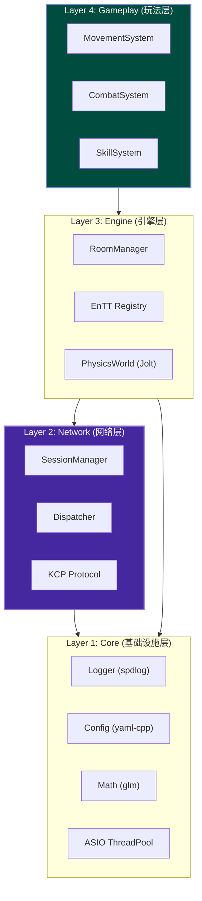
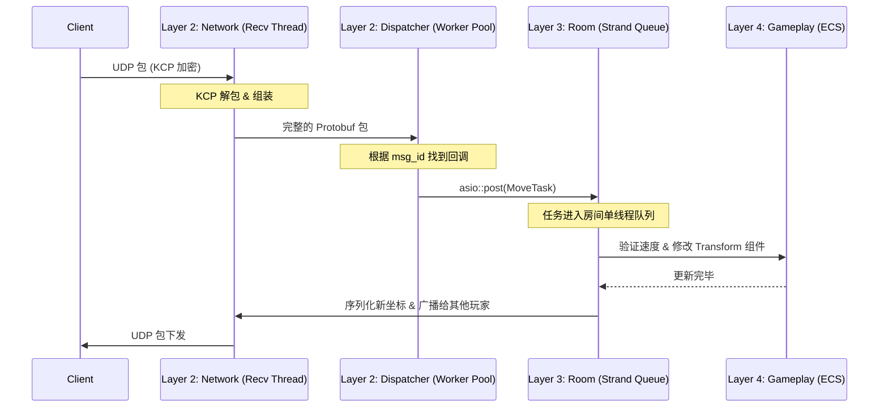
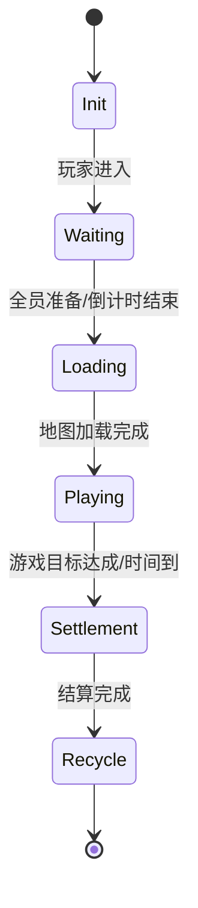
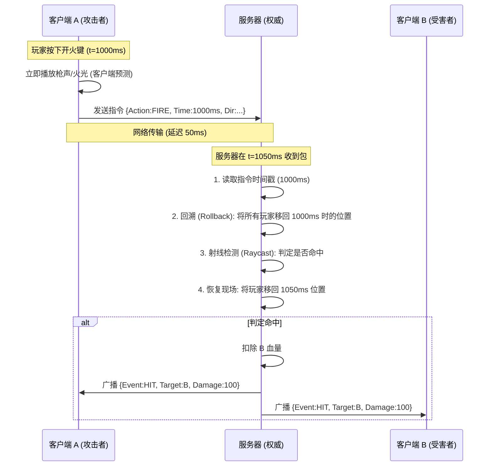
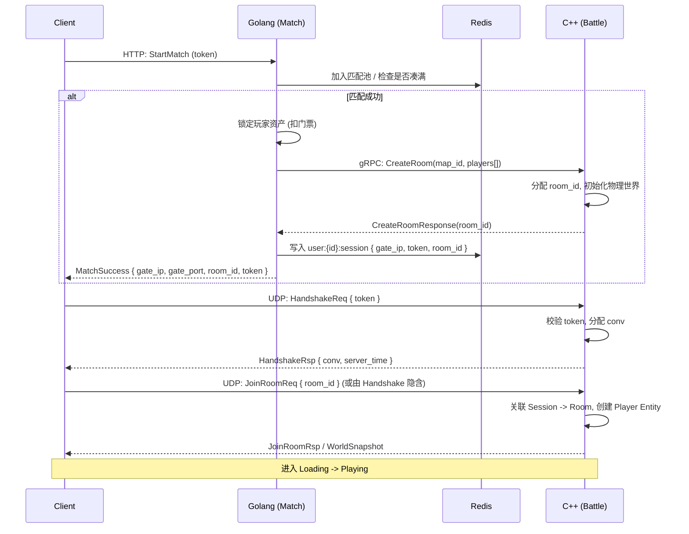

# cpp-server 项目架构与设计规范 (Architecture & Design)

本文档是 `cpp-server` 战斗服务器的完整架构设计文档。所有的架构设计、开发规范和技术细节均在此汇总。

***

## 1. 核心架构与分层 (Core Architecture)

### 系统分层与微服务职责 (System Layering & Microservices)

#### 1. 语言分工：C++ 与 Golang 的微服务联动

采用 **C++ (核心战斗)** + **Golang (外围业务)** 的混合架构是业界主流方案（如腾讯、网易大型项目）。

##### 1.1 C++ Server (cpp-server)

**定位**：**CPU 密集型 + 强实时**。负责游戏内的每一帧计算。

- **核心战斗循环 (Tick Loop)**：维持固定帧率（如 60Hz/128Hz）的逻辑驱动。
- **物理与碰撞**：
  - **射线检测 (Raycast)**：用于判定远程武器（狙击、步枪）是否命中。
  - **碰撞检测 (Collision)**：用于处理近战攻击、手雷爆炸范围、角色移动阻挡。
- **网络同步**：
  - **状态同步/帧同步**：计算服务器权威状态，通过 KCP 下发 Snapshot 或 Delta。
  - **延迟补偿 (Lag Compensation)**：回滚世界状态历史快照，解决高 Ping 玩家“瞄准了打不中”的问题。
- **视野管理 (AOI)**：计算九宫格/四叉树，只向玩家同步其视野范围内的实体。

##### 1.2 Golang Server (go-server)

**定位**：**I/O 密集型 + 弱实时**。负责与数据库、Web 前端交互。

- **接入层**：账号注册、登录鉴权 (HTTP/HTTPS)、JWT Token 生成。
- **局外经济 (Meta Economy)**：商城购买、背包管理、皮肤库存（读写 MySQL/Redis）。**涉及真金白银的逻辑必须在此层处理**。
- **匹配系统 (Matchmaking)**：基于 ELO 分数的匹配池，组队逻辑。
- **社交系统**：好友、聊天、公会、排行榜。
- **资源调度**：当匹配成功后，通过 RPC 通知 C++ Server 创建房间，并将玩家分配过去。

**通信方式**：内网服务间推荐使用 **gRPC** 或 **Redis Pub/Sub**。

#### 2. 架构分层原则 (Layered Architecture)

为了防止项目后期代码腐化和重复造轮子，C++ 端必须严格遵守以下分层原则。**能用成熟库，绝不手写。**



- **Layer 1 (Core)**: 纯工具，不依赖任何上层业务。
- **Layer 2 (Network)**: 负责收发包。**严禁**包含游戏逻辑（如“扣血”、“移动判定”）。收到包后应抛出 Event 或调用 Engine 层接口。
- **Layer 3 (Engine)**: 负责对象生命周期、物理世界 Tick、房间管理。它是连接网络与玩法的桥梁。
- **Layer 4 (Gameplay)**: 纯 ECS System。只关心数据变换（如 `Health -= Damage`）。

***

### 技术栈选型规范 (Tech Stack & Conventions)

#### 1. 黄金技术栈选型 (Standard Stack)

为了防止代码腐化，必须严格遵守以下选型：

| 领域         | 推荐库                    | 理由                          | 替代方案 (不推荐)                         |
| :--------- | :--------------------- | :-------------------------- | :--------------------------------- |
| **ECS 框架** | **EnTT**               | 现代 C++ 事实标准，性能极高，API 优雅     | 纯手写 Entity 类, Unity 风格的 GameObject |
| **物理引擎**   | **Jolt Physics**       | 下一代物理引擎，多线程性能强 (Horizon 使用) | PhysX (太重), Bullet3 (老旧)           |
| **日志系统**   | **spdlog**             | 极快，异步，零成本抽象                 | std::cout, printf, glog            |
| **配置读取**   | **yaml-cpp**           | 适合人类阅读的配置文件格式               | XML, INI, 手写解析                     |
| **数学库**    | **glm**                | 图形学标准，与 GLSL 一致，方便移植 Shader | Eigen (太重), 手写 Vector3             |
| **依赖管理**   | **CMake FetchContent** | 原生支持，无需安装额外包管理器             | 手动下载 zip, git submodule            |
| **AOI 算法** | **Grid / Quadtree**    | 大地图视野管理标准解法                 | 全广播 (O(N^2) 性能灾难)                  |

#### 2. 目录结构规范

```text
src/
├── core/           # Layer 1: 日志, 数学, 配置 (如 config.h, utils.h)
├── network/        # Layer 2: 网络底层 (如 kcp_session, udp_server, dispatcher)
├── engine/         # Layer 3: 核心系统 (如 room, physics_world, ecs_registry)
├── gameplay/       # Layer 4: 玩法逻辑
│   ├── systems/    # 如 movement_system, combat_system
│   └── components/ # 如 transform, health
└── main.cpp        # 入口
```

#### 3. 开发测试工具链

鉴于 Unity 测试流程繁琐（启动慢、编译久），**强烈建议**采用“工具先行”的开发模式。

**工作流： cpp-server (后端) + KcpProbe (调试终端/协议验证) + Unity (最终表现)**

1. **无缝移植**：`KcpProbe` 中的 `Kcp.Core` 模块是纯 .NET Standard 代码，可直接复制到 Unity 项目中复用。
2. **验证闭环**：开发新协议时，先在 `KcpProbe` (WinUI) 中添加测试按钮或页签。验证逻辑正确后，再去 Unity 接入表现。这能提升 10 倍开发效率。
3. **自动化回归**：利用 `Kcp.SmokeTests`，每次修改 C++ 核心代码后运行测试，确保服务器稳定。

***

### 并发与内存管理模型 (Concurrency & Memory)

为了避免 C++ 常见的死锁、野指针和性能瓶颈，所有业务代码必须遵循以下动态规范。

#### 1. 并发与多线程模型 (Concurrency)

本项目采用 **"多线程收发网络 + 单线程/Strand 执行房间逻辑"** 的模型。

- **网络收发 (无锁设计)**：`recv_thread` 和 `update_thread` 负责底层的 UDP 接收和 KCP Tick。`SessionManager` 内部使用了分片锁 (`shards_`)，**业务代码不要直接操作 SessionManager**。
- **业务逻辑执行 (Actor 模式/Strand)**：
  - 为了避免 `std::mutex` 满天飞导致的死锁，**同一个** **`Room`** **的所有逻辑更新必须在同一个线程或 ASIO Strand 中串行执行**。
  - 当 `Dispatcher` 收到玩家的移动包时，**不能在回调中直接修改坐标**。必须通过 `asio::post(room->strand(), ...)` 将任务派发到该房间专属的执行队列中。
  - **禁忌**：严禁在业务逻辑中调用 `std::this_thread::sleep_for` 或执行同步数据库查询，这会阻塞整个工作线程。
- **Jolt Physics 多线程与 Strand 的安全交互**：
  - Jolt 内部自带极强的 Job System。在 `PhysicsSystem->Step(dt)` 期间，物理碰撞回调 (`ContactListener`) 会在多个 Worker Thread 中并发触发。
  - **严禁**在物理回调中直接修改 EnTT 组件，这会破坏 Strand 的单线程假设，导致多线程 Data Race 和 Crash。
  - **正确做法**：必须在 `ContactListener` 中做一层事件缓冲。物理线程只负责将碰撞事件（如谁碰了谁、法线、冲量）写入一个 `ConcurrentQueue<CollisionEvent>`，然后在 ECS 的 `Post-Update` 阶段，由 Room Strand 单线程消费这个队列并修改 EnTT 数据。
- **gRPC 与 ASIO 异步整合**：
  - 业务层通过 C++ 调用 gRPC 向 Golang 汇报战绩时，**严禁**在 ASIO 网络线程或 Room Strand 中发起同步 gRPC 调用，这会严重阻塞核心 Tick 循环。
  - **正确做法**：建议在 C++ 端封装一个专门的 `RPC_Strand` 或独立线程池，将组装好的 Protobuf 消息丢进去异步发送，或者改用纯 TCP 的 Protobuf 封包，由 ASIO 统一接管 I/O。

#### 2. 内存与对象生命周期 (Memory Management)

游戏服务器中对象生成销毁极度频繁，必须严格控制指针：

- **智能指针原则**：
  - 跨模块持有长期对象（如 `Room` 级持有 `Player`），使用 `std::shared_ptr`。
  - 网络层回调中捕获 Session，必须使用 `std::weak_ptr`，并在使用前 `lock()` 检查是否存活，**严防玩家断线后导致的悬空指针 (Dangling Pointer)**。
- **ECS 数据原则**：
  - 在 Gameplay 层，**坚决不使用指针**。玩家、怪物、子弹都是 `EnTT` 中的一个 `uint32_t` (Entity ID)。
  - 如果需要引用另一个实体，只保存其 `Entity ID`，而不是保存 `Entity*`。
- **高频对象 (如子弹)**：严禁使用 `new/delete`。必须由 `EnTT` 的内存池管理，或自己实现 `ObjectPool`。

#### 3. 核心业务时序流 (Workflow)

以下是一个典型的“玩家移动同步”的完整数据流向：



**关键点说明**：网络层 (N/D) 负责解包后，立刻通过 `asio::post` 把控制权交接给引擎层 (R)。这保证了即使有 1000 个玩家同时发包，房间内的数据修改绝对是线程安全且无锁的。

***

## 2. 核心战斗逻辑 (Battle Core)

### 游戏循环与房间生命周期 (Game Loop & Room Lifecycle)

#### 1. 房间生命周期 (Room Lifecycle)

房间 (Room) 是战斗逻辑的承载单元，其状态机如下：



- **Init**: 分配房间 ID，初始化物理世界 (`Jolt Physics System`)。
- **Waiting**: 等待玩家连接 (`SessionManager` 关联 Session 到 Room)。
- **Loading**: 广播地图种子，等待客户端反馈 `LoadComplete`。
- **Playing**: **核心战斗阶段**。执行 ECS 系统和物理模拟。
- **Settlement**: 停止物理模拟，统计战绩，上传至 Golang 业务服。
- **Recycle**: 踢出所有玩家，释放物理世界内存，归还对象池。

#### 2. 核心 Tick 循环 (The Tick Loop)

服务器主循环维持固定频率 (如 60Hz, dt=16.6ms)，严格按序执行：

1. **Network Recv**: 从 `SessionManager` 的输入队列提取所有玩家的操作指令 (`Cmd`)。
2. **Pre-Update**:
   - 处理玩家加入/离开。
   - 应用玩家输入 (Input Prediction)。
3. **Physics Simulate**:
   - `JoltPhysics->Optimize()`
   - `PhysicsSystem->Step(dt)`: 执行物理步进。
4. **ECS Logic Update**:
   - `MovementSystem`: 更新位置。
   - `SkillSystem`: 冷却与技能释放。
   - `CombatSystem`: 判定伤害与血量。
5. **Post-Update**:
   - 脏数据标记 (Dirty Flag)。
   - 生成快照 (Snapshot Generation)。
6. **Network Send**:
   - 将快照序列化，通过 KCP 广播给房间内所有玩家。

#### 3. 线程模型 (Threading Model)

遵循 **Actor 模型** 或 **Strand 模型**：

- **Main/Worker Threads**: 网络 I/O (收发包)。
- **Room Strand**: **每个房间独占一个 Strand**。
  - 保证房间内的 `Physics` 和 `ECS` 逻辑是**单线程串行**的，无需加锁。
  - 不同房间可并行执行在不同线程上。

#### 4. 异常处理

- **Crash**: 房间逻辑异常需捕获，避免拖垮整个进程。
- **Stuck**: 监控 Tick 耗时，若超过 `dt` (16ms) 需报警 (Lag Spike)。

***

### 战斗判定与延迟补偿 (Combat & Lag Compensation)

本文档详细解析了 3D PVP 射击游戏中的核心同步技术，包括延迟补偿 (Lag Compensation)、CS2 的 Sub-tick 架构以及服务器性能优化策略。

#### 1. 伤害判定模型 (Damage Model)

##### 1.1 基础伤害公式

服务器权威计算伤害，公式如下：

```cpp
FinalDamage = (BaseDamage * DistanceFactor * BodyPartFactor) - ArmorReduction
```

- **BaseDamage**: 武器基础伤害 (配置表)。
- **DistanceFactor**: 距离衰减系数。
  - 例如：`0-10m: 1.0`, `10-50m: 0.8`, `>50m: 0.5`。
- **BodyPartFactor**: 部位系数。
  - `Head`: 4.0 (爆头)
  - `Chest`: 1.0
  - `Stomach`: 1.25
  - `Legs`: 0.75
- **ArmorReduction**: 护甲减免 (如 `ArmorValue * 0.5`)。

##### 1.2 ECS 与 Jolt 集成

伤害判定系统 (`CombatSystem`) 依赖 Jolt Physics 进行精确检测，支持**远程武器 (射线)** 与 **近战武器 (球体/盒体 Overlap)**。

###### 1.2.1 远程武器 (Ranged) — Raycast

```cpp
// 伪代码：CombatSystem 处理远程开火请求
void CombatSystem::handle_fire(entt::registry& registry, FireRequest& req) {
    auto& transform = registry.get<Transform>(req.shooter_id);
    auto& weapon = registry.get<Weapon>(req.shooter_id);
    if (weapon.weapon_type != WEAPON_RANGED) return;

    lag_compensation_sys.rollback_world(req.timestamp);

    JPH::RayCast ray(transform.pos, req.direction * weapon.attack_range);
    JPH::RayCastResult hit;
    if (physics_system.CastRay(ray, hit)) {
        entt::entity target = physics_system.GetEntity(hit.BodyID);
        float part_factor = get_body_part_factor(hit.SubShapeID);
        apply_damage(target, weapon.damage * part_factor);
    }

    lag_compensation_sys.restore_world();
}
```

###### 1.2.2 近战武器 (Melee) — Swept Volume (Shapecast)

**判定修正**：近战不是瞬间的点判定，而是“挥砍 (Swing)”。如果只在收到请求的那一帧做一次 `SphereCast`，很容易出现“穿模漏判”。
**方案**：采用 **多帧扫掠体积 (Swept Volume)** 或 **Shapecast**。

```cpp
// 伪代码：CombatSystem 处理近战攻击请求
void CombatSystem::handle_melee(entt::registry& registry, MeleeAttackRequest& req) {
    auto& transform = registry.get<Transform>(req.attacker_id);
    auto& weapon = registry.get<Weapon>(req.attacker_id);
    if (weapon.weapon_type != WEAPON_MELEE) return;

    lag_compensation_sys.rollback_world(req.timestamp);

    // Shapecast: 检测从上一帧位置到当前帧位置的扫掠体积
    // 形状可以是 Sphere 或 Box，路径是挥舞的圆弧
    JPH::ShapeCast shape_cast(weapon.shape, weapon.start_pos, weapon.end_pos);
    JPH::ShapeCastResult hit;
    
    if (physics_system.CastShape(shape_cast, hit)) {
        entt::entity target = physics_system.GetEntity(hit.BodyID);
        if (target != req.attacker_id) {
            apply_damage(target, weapon.damage);
        }
    }

    lag_compensation_sys.restore_world();
}
```

**判定方式总结**：

| 武器类型 | Jolt 检测 | 用途 |
| :--- | :--- | :--- |
| **Ranged** | `CastRay` | 狙击、步枪等远程武器 |
| **Melee** | **`CastShape` (Swept)** | 近战挥砍 (避免穿模) |

#### 2. 延迟补偿 (Lag Compensation) 流程

在网络延迟存在的情况下，如何保证“所见即所得”的射击体验？核心机制是服务器的**时间回溯**。

##### 2.1 完整交互时序图



##### 2.2 幽灵实体与物理延迟回收 (Ghost Entities & GC)

**致命漏洞规避**：当玩家死亡或物体被破坏时，**绝对不能**立即调用 `registry.destroy(entity)` 并从物理世界移除 Body。如果直接移除，当高延迟玩家的开火指令（携带过去的 timestamp）到达并触发回滚时，目标实体的物理碰撞体已经不存在，会导致本该命中的子弹判定为空（即“幽灵实体”问题）。

**正确做法**：

1. **挂载 DeathTag**：实体死亡时，挂载 `DeathTag` 组件，隐藏其渲染状态，并关闭常规的移动和逻辑更新。
2. **物理层迁移**：将其 Jolt Physics Body 移动到专用的“历史物理层 (History Layer)”，使其不参与正常物理碰撞，但**依然能被延迟补偿的射线检测 (Raycast) 扫中**。
3. **延迟回收 (Delayed GC)**：设定存活时间至少等于最大延迟补偿时间（如 500ms），时间到达后再做真正的 `registry.destroy` 垃圾回收。

#### 3. Sub-tick 与高频 Tick 架构预期 (Tickrate Architecture)

本项目目前放弃过于理想化的 CS2 微秒级 Sub-tick 架构，采用**高频固定 Tick (64/128Hz) + 传统延迟补偿**的务实路线。

##### 3.1 为什么放弃 Sub-tick？

- **物理引擎限制**：Jolt Physics 默认基于固定步长 (Fixed Timestep) 运行。实现 Sub-tick 需要接管物理引擎的形变计算并精确插值 Jolt 内部的 Hitbox (Shape)，这会导致指数级的服务器 CPU 消耗。
- **ROI 极低**：对于绝大多数中小团队的第一款射击游戏，老老实实做好 64/128 Tick 的强同步，配合良好的客户端预测与服务器延迟补偿，已足以提供极佳的射击手感。

##### 3.2 替代实现关键点

1. **高频固定 Tick**：服务器物理与逻辑均采用 64Hz 或 128Hz 运行，确保判定粒度足够细（每帧 7.8ms 或 15.6ms）。
2. **历史快照缓存**：服务器为每个 `PhysicsBody` 缓存过去 500ms 的 Transform 快照，严格按照固定 Tick 时间戳进行回滚。

#### 4. 服务器性能优化策略

- **AOI (Area of Interest)**: 使用九宫格或四叉树算法，只对玩家视野内的实体进行同步和物理检测。
- **LOD (Level of Detail)**: 远处的物体降低物理检测频率（如每秒只算 10 次），近处的物体全频率计算（每秒 60 次）。
- **ECS 并行化**: 利用 EnTT 等框架，将无依赖的系统（如移动、回血）分散到多核 CPU 上并行执行。

***

### 协议与消息定义规范 (Protocol Design)

#### 1. 协议设计原则

- *   **序列化格式**:
    *   **低频 RPC / 事件**: Protobuf v3 (如 `JoinRoom`, `FireEvent`, `BattleResult`)，开发效率优先。
    *   **高频移动同步**: **二进制位打包 (Bit-packing) 或 FlatBuffers**。
        *   **原因**: Protobuf 的 Varint 编码和内存分配在高频（60Hz * 100人）场景下是 CPU 杀手。
        *   **压缩策略**:
            *   **Yaw (朝向)**: 0-360度压缩为 `uint16_t` (精度 0.005度)。
            *   **Position**: 使用定点数或半精度浮点。
            *   **Velocity**: 压缩为 `int16_t`。
*   **传输层**: UDP + KCP (核心战斗), TCP/HTTP (业务逻辑)。
- **大小端**: 网络字节序 (Big Endian)。
- **消息结构**:
  ```
  [4 bytes KCP Conv] [KCP Header...] [Protobuf Payload]
  ```

##### 1.1 传输通道划分 (KCP & Raw UDP)
为了平衡实时性与可靠性，必须采用**双轨制网络传输**，并实施**单端口多路复用 (Single Port Multiplexing)**。

*   **端口复用 (Multiplexing)**：为了提高 NAT 穿透率并避免断线重连问题，**KCP 和 Raw UDP 必须复用同一个 UDP 端口**。
    *   **Header Flag**: 在所有 UDP 包的最前面加 1 个字节的 Header Flag。
    *   `0x01`: 代表 KCP 包，交给 `ikcp_input` 处理。
    *   `0x02`: 代表 Raw UDP 包（移动同步），直接反序列化处理。
    *   `Dispatcher` 收到包后，先读取这 1 个字节，再分流到不同的处理逻辑。

*   **Raw UDP (Unreliable, Flag 0x02)**: 高频移动同步 (`Input`, `Snapshot`)。直接走底层 UDP 报文，丢包不管，永远只处理最新的包。
*   **KCP (Reliable, Flag 0x01)**: 关键业务逻辑 (`Fire`, `Hit`, `Die`, `JoinRoom`)。走 KCP 协议通道，保证必须到达且有序。

##### 1.2 MTU 与分包 (Fragmentation)

- **MTU 限制**: 默认 `1200` 字节 (保守值，适应公网环境)。
- **分包策略**:
  - KCP 协议层自动处理分包 (Fragment)。
  - **应用层限制**: 单个 Protobuf 包体尽量控制在 1KB 以内。
  - **大包处理**: 如需发送地图数据 (>10KB)，应在应用层拆分为多个 Chunk (`MapDataChunk { index, total, data }`)，避免阻塞 KCP 发送队列。

#### 2. 消息 ID 分段 (Message ID Allocation)

为了避免 ID 冲突，严格按照功能模块划分 MsgID：

| ID 范围           | 模块                 | 描述                         |
| :-------------- | :----------------- | :------------------------- |
| **0 - 99**      | **System**         | 心跳, 握手, 错误码, 时间同步          |
| **100 - 999**   | **Lobby**          | 登录, 匹配, 房间列表, 聊天           |
| **1000 - 1999** | **Room**           | 进出房间, 加载地图, 准备就绪           |
| **2000 - 2999** | **Battle (Sync)**  | 移动同步, 动作状态, 武器切换           |
| **3000 - 3999** | **Battle (Event)** | 射击, 近战攻击, 命中, 死亡, 复活, 掉落拾取 |
| **4000 - 4999** | **Debug**          | GM 指令, 调试信息                |

#### 3. 核心交互流程 (Interaction Flow)

##### 3.1 登录与握手 (Handshake)

1. **Client -> Server (HTTP)**: 登录账号，获取 `SessionToken` 和 `KcpPort`。
2. **Client -> Server (UDP)**: 发送 `HandshakeReq { token }`。
3. **Server**: 验证 Token，分配 `KcpConv`。
4. **Server -> Client (UDP)**: 返回 `HandshakeRsp { conv, seed }`。

##### 3.2 战斗循环与增量同步 (Battle Loop & Delta Sync)

- **Input**: 客户端以 60Hz/128Hz 采样输入，发送 `PlayerInput { last_ack_seq, move_dir, view_angle, buttons }`。
- **Delta Snapshot (增量更新)**:
  - **问题**：如果每秒 30 次下发全量快照，百人房间会导致带宽瞬间爆炸（可能达到数MB/s）。
  - **机制**：服务器缓存最近 N 帧的历史快照。当收到客户端的 `last_ack_seq` 后，服务器比对当前帧与 `last_ack_seq` 帧，**仅提取发生变化的 Component** 下发 `DeltaSnapshot`。
- **Event**: 关键事件（开火、近战攻击、击杀）实时可靠发送。

#### 4. Battle Event 消息与 MsgID

| MsgID    | 消息               | 方向  | 说明                            |
| :------- | :--------------- | :-- | :---------------------------- |
| **3001** | FireEvent        | C→S | 远程武器开火，采用 Raycast 判定          |
| **3002** | MeleeAttackEvent | C→S | 近战攻击，采用 Sphere/Box Overlap 判定 |
| **3010** | HitEvent         | S→C | 命中广播（远程/近战统一）                 |

**FireEvent** 字段说明：

| 字段           | 类型      | 说明                      |
| :----------- | :------ | :---------------------- |
| shooter\_id  | uint32  | 开火者实体 ID                |
| origin       | Vector3 | 射线起点（枪口位置）              |
| direction    | Vector3 | 射线方向（单位向量）              |
| weapon\_id   | uint32  | 武器配置 ID                 |
| weapon\_type | uint32  | 0=Ranged, 1=Melee（兼容复用） |

**MeleeAttackEvent** 字段说明：

| 字段           | 类型      | 说明                 |
| :----------- | :------ | :----------------- |
| attacker\_id | uint32  | 攻击者实体 ID           |
| direction    | Vector3 | 攻击方向（单位向量）         |
| weapon\_id   | uint32  | 武器配置 ID            |
| timestamp    | uint32  | 客户端时间戳 (ms)，用于延迟补偿 |

#### 5. Protobuf 消息定义

最新的消息结构定义请直接参考项目源码：

- **[proto/base.proto](proto/base.proto)**

该文件包含了 System, Battle Sync, Battle Event 等所有核心协议的 Protobuf 定义，是开发的唯一真理来源 (Single Source of Truth)。

#### 6. 错误码定义 (Error Codes)

| Code | Name                  | Description        |
| :--- | :-------------------- | :----------------- |
| 0    | OK                    | 成功                 |
| 1001 | ERR\_TOKEN\_INVALID   | Token 无效或过期        |
| 2001 | ERR\_ROOM\_NOT\_FOUND | 房间不存在              |
| 2002 | ERR\_ROOM\_FULL       | 房间已满               |
| 3001 | ERR\_SYNC\_ILLEGAL    | 移动速度异常 (SpeedHack) |

#### 7. Proto 文件管理

所有 `.proto` 文件存放于 `proto/` 目录，禁止修改自动生成的代码。

- **详细协议Payload结构定义请参考：** [PROTOCOL.md](PROTOCOL.md)

***

### ECS 组件定义规范 (ECS Components)

本文档定义 `cpp-server` 战斗服中 EnTT 所使用的核心 Component，是 Layer 4 (Gameplay) 开发的标准参考。

#### 1. 设计原则

- **纯数据结构**：Component 不包含方法，仅存储数据。
- **无指针**：跨实体引用只存 `entt::entity` (uint32\_t)。
- **命名**：使用 `PascalCase`，与 EnTT 惯例一致。

#### 2. 核心组件清单

##### 2.0 网络跨端映射组件 (Network Component)

**致命漏洞规避**：绝对不能直接使用 `entt::entity` (uint32\_t) 作为网络同步 ID。因为 EnTT 的实体 ID 内部实现是自增结合版本号，在服务器和多个客户端之间天然无法保持一致。

```cpp
struct NetworkComponent {
    uint32_t net_id;       // 全局唯一，由服务器统一分配，网络同步唯一凭证
    uint32_t owner_conv;   // 归属的玩家 KCP Conv，用于客户端预测鉴权
};
```

- **规范**：所有网络协议（快照、开火、命中）中传递的实体 ID 必须是 `net_id`。服务器 `Room` 级别必须维护一个 `std::unordered_map<uint32_t, entt::entity>` 用于双向快速查找。

##### 2.1 基础空间组件

| 组件名             | 字段                                          | 用途                                   |
| :-------------- | :------------------------------------------ | :----------------------------------- |
| **Transform**   | `glm::vec3 pos`, `float yaw`, `float pitch` | 世界坐标与朝向，所有可移动实体的基础                   |
| **Velocity**    | `glm::vec3 linear`, `glm::vec3 angular`     | 线速度、角速度，物理系统写入                       |
| **PhysicsBody** | `JPH::BodyID body_id`                       | Jolt 刚体 ID，用于 Raycast/Collision 实体映射 |

##### 2.2 玩家相关

| 组件名             | 字段                                                                                        | 用途                            |
| :-------------- | :---------------------------------------------------------------------------------------- | :---------------------------- |
| **PlayerState** | `uint64_t user_id`, `uint32_t conv`, `uint32_t flags`, `glm::vec3 last_pos`               | 玩家身份、KCP Conv、状态标志、上一帧位置（校验用） |
| **Health**      | `int32_t current`, `int32_t max`, `int32_t armor`                                         | 血量、护甲，CombatSystem 读写         |
| **InputState**  | `glm::vec3 move_dir`, `float yaw`, `float pitch`, `uint32_t buttons`, `uint32_t last_seq` | 最近收到的输入，用于移动与校验               |

##### 2.3 战斗与武器

| 组件名        | 字段                                                                                                                                                | 用途                                                                       |
| :--------- | :------------------------------------------------------------------------------------------------------------------------------------------------ | :----------------------------------------------------------------------- |
| **Weapon** | `uint32_t weapon_id`, `uint8_t weapon_type` (0=Ranged, 1=Melee), `int32_t ammo`, `float next_fire_time`, `float attack_range`, `float hit_radius` | 武器 ID、类型、弹药、射速冷却；远程用 ammo/next\_fire\_time，近战用 attack\_range/hit\_radius |
| **Hitbox** | `uint8_t body_part` (Head=0, Chest=1, Stomach=2, Legs=3)                                                                                          | 命中部位系数映射                                                                 |

**武器类型说明**：

- **Ranged (0)**：`ammo` 有效，`next_fire_time` 控制射速，判定采用 Raycast。
- **Melee (1)**：`ammo` 可为 -1（无限），`attack_range` 与 `hit_radius` 用于球体/盒体 Overlap 检测。

##### 2.4 延迟补偿

| 组件名                   | 字段                                            | 用途                          |
| :-------------------- | :-------------------------------------------- | :-------------------------- |
| **TransformSnapshot** | `std::vector<std::pair<uint32_t, Transform>>` | 历史 Transform 快照 (时间戳 -> 状态) |

##### 2.5 标签组件 (Tag)

| 组件名                   | 说明       |
| :-------------------- | :------- |
| **PlayerTag**         | 标识玩家实体   |
| **ProjectileTag**     | 标识子弹/投掷物 |
| **StaticObstacleTag** | 静态碰撞体    |

##### 2.6 背包与交互组件 (Inventory & Interaction)

| 组件名 | 字段 | 用途 |
| :--- | :--- | :--- |
| **Inventory** | `std::vector<Item> items`, `float max_weight` | 玩家背包，存储武器、弹药、药品。 |
| **LootItem** | `uint32_t item_id`, `uint32_t count` | 地面掉落物组件。 |
| **Interactable** | `float radius`, `uint8_t type` | 标识实体可交互（拾取、开门）。**注意：地面道具仅在 ECS 记录坐标，不要创建物理刚体 (Body)，以节省性能。** |

#### 3. 系统与组件依赖

| 系统 | 读取组件 | 写入组件 |
| :--- | :--- | :--- |
| MovementSystem | Transform, Velocity, InputState | Transform |
| CombatSystem | Transform, Health, Weapon, PhysicsBody | Health, Weapon |
| **InventorySystem** | Transform, Inventory, LootItem | Inventory, LootItem (Destroy) |
| MovementValidationSystem | Transform, Velocity, PlayerState | PlayerState, Transform |
| LagCompensationSystem | TransformSnapshot | （临时回滚，不持久写入） |

***

## 3. 安全与数据 (Security & Data)

### 服务器校验与防篡改机制 (Server Validation & Anti-Cheat)

本文档详细阐述了 PVP 游戏服务器如何防止客户端作弊和消息篡改。

#### 1. 核心原则：永不信任客户端

**所有的防御机制都基于一个核心假设：客户端运行在用户的机器上，因此它完全不可信。**

#### 2. 四层防御体系

##### 第一层：传输通道加密 (防窃听)

- **推荐方案**: **AES-GCM-256** 或 **ChaCha20-Poly1305**。
- **握手流程**:
  1. Client -> Server: `Hello { ClientRandom, PubKey_C }` (ECDH)
  2. Server -> Client: `Welcome { ServerRandom, PubKey_S }` (ECDH)
  3. 双方计算共享密钥 `SharedSecret`。
  4. 派生会话密钥 `SessionKey`。

##### 第二层：数据包签名与校验 (防篡改)

- **HMAC**: 关键指令（如 `Fire`）附带 HMAC-SHA256 签名。
- **Replay Protection**: 使用滑动窗口机制检查 `Sequence ID` 和 `Timestamp`，拒绝重放包。

##### 第三层：ECS 逻辑校验 (EnTT Implementation)

利用 EnTT 系统在每一帧进行逻辑检查。

```cpp
// 移动校验系统
void MovementValidationSystem::update(entt::registry& registry, float dt) {
    auto view = registry.view<const Transform, const Velocity, PlayerState>();
    
    view.each([dt](const auto entity, const auto& transform, const auto& vel, auto& state) {
        // 1. 速度检查 (SpeedHack)
        float speed = glm::length(vel.linear);
        if (speed > MAX_SPEED * 1.1f) { // 允许 10% 误差
            // 触发回拉 (Rubberbanding)
            state.flags |= STATE_ILLEGAL_MOVE;
            LOG_WARN("SpeedHack detected: entity {}", entity);
        }
        
        // 2. 穿墙检查 (Noclip)
        // 使用上一次位置到当前位置发射射线
        if (physics_world.RayCast(state.last_pos, transform.pos)) {
             // 修正位置到墙前
             transform.pos = state.last_pos;
        }
    });
}
```

##### 第四层：服务器端行为检测 (最终防线)

- **射速检查**: 检查两次开火间隔是否小于武器最小间隔。
- **自瞄检测**: 统计玩家准星的 Angular Velocity，如果瞬间锁定头部且无中间平滑过程，标记可疑。
- **资源校验**: 局内金币由 C++ 权威计算，不接受客户端上报的扣款结果。

#### 3. 总结

| 防御层级       | 针对威胁   | 技术手段                         |
| :--------- | :----- | :--------------------------- |
| **L1 传输层** | 网络抓包   | AES-GCM / ChaCha20           |
| **L2 协议层** | 篡改, 重放 | HMAC, SeqID, Timestamp       |
| **L3 逻辑层** | 加速, 穿墙 | EnTT System 校验, Jolt RayCast |
| **L4 行为层** | 自瞄, 透视 | 统计学分析, 启发式检测                 |

***

### 数据存储与持久化设计 (Storage Design)

#### 1. 数据分层策略

| 数据类型           | 存储介质             | 读写频率      | 负责服务          | 示例                        |
| :------------- | :--------------- | :-------- | :------------ | :------------------------ |
| **热数据 (Hot)**  | **Memory (RAM)** | 极高 (60Hz) | C++ Server    | 玩家实时坐标、血量、弹药              |
| **温数据 (Warm)** | **Redis**        | 高 (RPC调用) | Golang/C++    | Session Token、房间列表、玩家在线状态 |
| **冷数据 (Cold)** | **MySQL/Mongo**  | 低 (登录/结算) | Golang Server | 账号信息、背包道具、历史战绩            |

#### 2. C++ Server 数据管理

C++ 战斗服原则上**不直接连接数据库 (MySQL)**，只连接 **Redis** (可选) 或通过 **RPC** 与 Golang 业务服交互。

##### 2.1 玩家数据加载 (Load)

1. 玩家请求匹配。
2. Golang 锁定玩家资产 (扣除门票)，将玩家基础属性 (Avatar, WeaponConfig) 打包。
3. Golang -> C++ (`CreateRoom` / `JoinRoom` RPC): 传递玩家数据。
4. C++ 将数据通过 `EnTT` 组件 (`Component`) 存入内存。

##### 2.2 玩家数据持久化 (Save)

- **实时保存**: 不推荐。战斗中不写库。
- **结算保存 (Settlement)**:
  1. 战斗结束。
  2. C++ 汇总战绩 (`Kills`, `Deaths`, `Damage`, `ItemsUsed`)。
  3. C++ -> Golang (`ReportBattleResult` RPC): 发送战报。
  4. Golang 校验战报合法性，写入 MySQL，更新排行榜。

##### 2.3 RPC 协议格式 (gRPC / Internal TCP)

推荐使用 gRPC 进行服务间通信。

```protobuf
// battle_service.proto
service BattleService {
    // 战斗结束上报
    rpc ReportBattleResult(BattleResultRequest) returns (BattleResultResponse);
}

message BattleResultRequest {
    int64 room_id = 1;
    int64 end_time = 2;
    repeated PlayerResult players = 3;
}

message PlayerResult {
    int64 user_id = 1;
    int32 kills = 2;
    int32 deaths = 3;
    int32 damage_dealt = 4;
    map<int32, int32> items_used = 5; // item_id -> count
}
```

#### 3. 断线重连 (Reconnection)

为了支持玩家掉线后快速重回战斗：

1. **Session 保持**: 玩家掉线后，C++ 服务器保留其 `Entity` 和 `Session` 对象（标记为 `Disconnected`）一段时间（如 60秒）。
2. **重连流程**:
   - Client -> Golang (Login): 获取当前是否有未结束的战斗。
   - Golang -> Redis: 查询 `user:{id}:session` 获取 `gate_ip` 和 `token`。
   - Golang -> Client: 返回战斗服地址。
   - Client -> C++ (UDP): 发送 `HandshakeReq { token, is_reconnect: true }`。
   - C++: 校验 Token，恢复 `Session` 关联，准备下发全量状态。
3. **全量状态恢复与大包分片 (Fragmentation)**:
   - **问题**：由于 UDP/KCP 的 MTU 限制（约1200字节），包含全量玩家、掉落物、场景破坏状态的全量快照极有可能超过 10KB。如果直接塞进单包会被路由器直接丢弃。
   - **机制**：必须设计专用的 `SyncRoomStateChunk` 机制。服务器在应用层将全量数据拆分为多个 Chunk（如 `Chunk [1/5]`），客户端收到所有分片并拼接完成后，再开始进入预测和渲染循环。

#### 4. Redis Key 设计规范 (Draft)

- `room:{id}:info` -> Hash { map\_id, create\_time, status }
- `user:{id}:session` -> String { token, gate\_ip, gate\_port, room\_id }
- `rank:season:{id}` -> ZSet { score, user\_id }

#### 5. 灾备与回档

- **崩溃恢复**: C++ 进程崩溃会导致房间销毁。需依靠 Golang 服检测心跳超时，退还玩家门票，并记录异常日志。

***

### C++ 与 Golang 服务间 RPC 接口规范 (RPC API)

本文档定义 `cpp-server` 与 `go-server` 之间的 gRPC 接口，用于匹配、房间管理与战斗结算。

#### 1. 通信方式

- **协议**：gRPC (HTTP/2 + Protobuf)
- **方向**：Golang 为客户端，C++ 为服务端（Golang 主动调用 C++）
- **备选**：Redis Pub/Sub 用于轻量级通知

#### 2. 服务定义 (battle\_service.proto)

```protobuf
service BattleService {
    // 创建房间（匹配成功后调用）
    rpc CreateRoom(CreateRoomRequest) returns (CreateRoomResponse);
    // 玩家加入房间
    rpc JoinRoom(JoinRoomRequest) returns (JoinRoomResponse);
    // 玩家离开/掉线通知
    rpc LeaveRoom(LeaveRoomRequest) returns (LeaveRoomResponse);
    // 战斗结算上报
    rpc ReportBattleResult(BattleResultRequest) returns (BattleResultResponse);
    // 心跳/存活检测（可选）
    rpc HealthCheck(HealthCheckRequest) returns (HealthCheckResponse);
}

message CreateRoomRequest {
    int64 match_id = 1;
    int32 map_id = 2;
    repeated PlayerSlot players = 3;
}

message PlayerSlot {
    int64 user_id = 1;
    string token = 2;
    bytes avatar_config = 3;  // 角色/武器配置
}

message CreateRoomResponse {
    int32 code = 1;
    int64 room_id = 2;
    string error_message = 3;
}

message JoinRoomRequest {
    int64 room_id = 1;
    int64 user_id = 2;
    string token = 3;
}

message JoinRoomResponse {
    int32 code = 1;
    string error_message = 2;
}

message LeaveRoomRequest {
    int64 room_id = 1;
    int64 user_id = 2;
    int32 reason = 3;  // 0=主动, 1=掉线, 2=踢出
}

message LeaveRoomResponse {
    int32 code = 1;
}

message BattleResultRequest {
    int64 room_id = 1;
    int64 end_time = 2;
    repeated PlayerResult players = 3;
}

message PlayerResult {
    int64 user_id = 1;
    int32 kills = 2;
    int32 deaths = 3;
    int32 damage_dealt = 4;
    map<int32, int32> items_used = 5;
}

message BattleResultResponse {
    int32 code = 1;
    string error_message = 2;
}
```

#### 3. 调用方职责

| 接口                 | 调用方    | 说明                                    |
| :----------------- | :----- | :------------------------------------ |
| CreateRoom         | Golang | 匹配成功时，传入玩家列表，C++ 分配 room\_id 并初始化     |
| JoinRoom           | Golang | 通知 C++ 某玩家将连入指定房间，C++ 预留 Slot         |
| LeaveRoom          | 双方     | Golang 主动踢人时调用；C++ 检测掉线后也可回调 Golang   |
| ReportBattleResult | C++    | 战斗结束时 C++ 主动调用 Golang，Golang 落库并更新排行榜 |

***

### 匹配与房间创建流程 (Matchmaking & Room Flow)

本文档描述从玩家点击「开始匹配」到进入战斗房间的端到端流程，涉及 Golang 与 C++ 的协作。

#### 1. 参与方

- **Client**：Unity/UE 客户端
- **Golang (go-server)**：匹配服务、账号、经济
- **C++ (cpp-server)**：战斗房间、Tick、物理

#### 2. 时序图



#### 3. 状态与约束

| 阶段           | Golang             | C++                              |
| :----------- | :----------------- | :------------------------------- |
| 匹配中          | 维护匹配池，凑满即创建房间      | 无                                |
| CreateRoom 后 | 等待 C++ 返回 room\_id | 分配 Room，状态 Init→Waiting          |
| 玩家连接         | 不感知                | 通过 Handshake 校验 token，关联 Session |
| 全员就绪         | 不感知                | Loading→Playing，开始 Tick          |

#### 4. 异常处理

| 场景                      | 处理                                    |
| :---------------------- | :------------------------------------ |
| CreateRoom 失败 (C++ 满负荷) | Golang 返回匹配失败，退还门票                    |
| 玩家 Handshake 超时         | C++ 等待 N 秒后释放 Slot；Golang 通过心跳检测可提前踢人 |
| 战斗中途 C++ 崩溃             | Golang 心跳超时，退还门票，记录日志                 |

***

## 4. 工程化与接入 (Engineering & Integration)

### 客户端接入指南 (Client Integration Guide)

#### 1. 概述

本指南面向 Unity/Unreal 客户端开发者，说明如何接入 `cpp-server` 战斗服。
核心难点在于：**预测 (Prediction)** 、 **和解 (Reconciliation)** 与 **插值 (Interpolation)**。

#### 2. 接入流程

##### 2.1 网络层接入

1. 引入 `Kcp.Core` (C#) 或相应 KCP 库。
2. 实现 `IConnection` 接口，对接 Protobuf 协议。
3. **时钟同步 (Clock Sync)**:
   - 客户端需维护 `ServerTime`，目标是将客户端时间与服务器时间对齐。
   - **算法 (NTP-like)**:
     1. Client 发送 `Ping { t1: LocalTime }`。
     2. Server 回复 `Pong { t1, t2: ServerRecvTime, t3: ServerSendTime }`。
     3. Client 收到 `Pong` (t4)，计算 `RTT = (t4 - t1) - (t3 - t2)`。
     4. `Offset = (t2 - t1 + t3 - t4) / 2`。
     5. `ServerTime = LocalTime + Offset`。
   - 建议每秒同步一次，取最近 5 次采样的中位数以消除抖动。

##### 2.2 移动同步 (Movement Sync)

###### 本地玩家：客户端预测 (Client-side Prediction)

- **不要等待服务器！**
- 当玩家按下 `W` 键：
  1. 立即在本地位移玩家。
  2. 记录输入指令 `Input { seq=100, dir=(0,0,1), dt=0.016 }` 到历史队列。
  3. 发送 `Input` 给服务器 (UDP Unreliable)。

###### 本地玩家：服务器和解 (Server Reconciliation)

- 客户端收到服务器快照 `Snapshot { last_processed_seq=100, pos=(10,0,10) }`。
- **校验**: 对比本地历史队列中 `seq=100` 时的位置与服务器位置。
- *   **回滚 (Reconciliation)**:
    *   **阈值判断**:
        *   误差 < 0.05m: 忽略，信任客户端。
        *   0.05m < 误差 < 2.0m (Lag Spike): **不要瞬移**。启用 **Rubberbanding (橡皮筋)** 平滑过渡，在接下来的 0.1~0.2秒内通过插值将玩家位置悄悄拉回服务器位置。
        *   误差 > 2.0m (Illegal/Hack): 强制瞬移重置位置。
    *   **重放 (Replay)**: 当发生拉回时，必须基于修正后的位置，重新模拟从 `last_ack_seq` 到 `current_seq` 的所有输入，以确保物理状态连续。

###### 远端玩家：实体插值 (Entity Interpolation)

- 对于其他玩家 (Remote Players)，客户端收到的位置是“过去”的（因为网络延迟）。
- **不要直接设置坐标**，否则会导致瞬移和卡顿。
- **插值算法**:
  1. 客户端维护一个 `SnapshotBuffer`，存储最近收到的快照。
  2. 设定 `RenderDelay` (如 100ms)，使得 `RenderTime = ServerTime - RenderDelay`。
  3. 在 Buffer 中找到两个快照 `S_prev` 和 `S_next`，满足 `S_prev.time <= RenderTime <= S_next.time`。
  4. 计算插值比例 `alpha = (RenderTime - S_prev.time) / (S_next.time - S_prev.time)`。
  5. `CurrentPos = Lerp(S_prev.pos, S_next.pos, alpha)`。

##### 2.3 射击与命中

- **客户端**: 播放枪口火光、音效（立即反馈）。
- **服务器**: 权威判定命中。
- **命中反馈**:
  - 客户端显示“击中提示 (Crosshair Hitmarker)”必须等待服务器的 `HitEvent` 下发。
  - **不要在客户端直接扣血**。

#### 3. 地图与场景共识加载 (Map & Scene Consensus)

为保证双端物理世界绝对一致，防止穿墙和“空气墙”，并解决大地图服务器 OOM 问题：

1.  **客户端导出工具链**：Unity/UE 端需要编写 Editor 脚本，将场景中的 Static Collider（地面、墙壁、掩体）导出为专用的格式（如定制的 `.obj` 或轻量级二进制）。
2.  **静态物理世界共享机制 (Static Physics Manager)**：
    *   **问题**：如果单台机器开 10 个吃鸡房间，每个房间加载独立的 2GB 地形数据，内存会瞬间爆炸。
    *   **解决方案**：设计进程级单例 `StaticPhysicsManager`。
    *   同一个 MapID 的底层静态地形和建筑的 `JPH::Shape` 必须在**进程级单例共享**。
    *   各 Room 的 `PhysicsSystem` 仅持有这些共享 Shape 的引用（指针），而只实例化动态实体（玩家、载具、空投）。

#### 4. 调试工具

- 使用 `KcpProbe` 工具模拟高延迟 (Simulate Latency) 和丢包 (Packet Loss)，验证预测算法的稳定性。
- 开启 `DrawDebug` 接收服务器的碰撞盒线框，对比客户端位置。

***

### 运维与监控标准 (Ops & Monitoring)

#### 1. 部署架构 (Deployment)

- **容器化**: 全面 Docker 化。
- **编排**: Kubernetes (K8s) 或 Docker Compose (单机)。
- **镜像**:
  - `cpp-server:latest` (基于 Alpine/Debian Slim, 仅包含二进制与依赖库)
  - `go-server:latest`

#### 2. 配置文件结构 (Configuration)

C++ 服务器启动时默认加载 `config.yaml`。

```yaml
server:
  ip: "0.0.0.0"
  port: 8888
  thread_pool_size: 4
  tick_rate: 60
  prometheus_port: 9090

kcp:
  nodelay: 1    # 1: 启用 nodelay
  interval: 10  # 内部时钟 (ms)
  resend: 2     # 快速重传
  nc: 1         # 关闭流控
  sndwnd: 512   # 发送窗口
  rcvwnd: 512   # 接收窗口
  mtu: 1200     # 考虑 Internet 1500 - UDP头 - IP头

log:
  level: "info" # debug, info, warn, error
  path: "logs/server.log"
  max_size: 10485760 # 10MB
  max_files: 5
```

#### 3. 平滑关闭 (Graceful Shutdown)

为了避免战斗中途服务器重启导致玩家掉线，必须实现平滑关闭流程。

1. **信号捕获**: 监听 `SIGTERM` / `SIGINT`。
2. **拒绝新连接**: 将 `ServerStatus` 设为 `Draining`，拒绝新的 `JoinRoom` 请求。
3. **等待结束**: 维持现有房间的 Tick 循环，直到所有房间自然结束 (GameOver)。
4. **强制超时**: 若超过 30分钟仍未结束，强制踢出所有玩家并保存数据。
5. **退出进程**: 释放资源，退出 `main` 函数。

#### 4. 监控指标 (Prometheus Metrics)

C++ 服务器需暴露 HTTP 接口 (如 `:9090/metrics`) 供 Prometheus 抓取。

##### 4.1 核心指标

- **`server_tick_duration_ms`**: (Histogram) 主循环耗时。**P99 必须 < 16ms**。
- **`online_players`**: (Gauge) 当前在线玩家数。
- **`active_rooms`**: (Gauge) 当前活跃房间数。
- **`network_in_bytes`** **/** **`network_out_bytes`**: (Counter) 流量吞吐。
- **`kcp_resend_count`**: (Counter) KCP 重传包数 (监控网络质量)。

#### 5. 日志规范 (Logging Standard)

使用 `spdlog` 异步日志，统一 JSON 格式以便 ELK 采集。

- **Level 定义**:
  - `DEBUG`: 详细的调试信息 (仅开发环境开启)。
  - `INFO`: 关键流程 (玩家进出、房间创建、结算)。
  - `WARN`: 逻辑异常但不影响运行 (如收到非法包、丢弃过期包)。
  - **`ERROR`**: 需要人工介入的错误 (配置加载失败、Redis 断连)。**必须触发报警**。
  - `CRITICAL`: 进程无法继续运行 (OOM, 核心服务不可用)。

##### 5.1 日志示例

```json
{
  "time": "2023-10-27T10:00:00Z",
  "level": "INFO",
  "module": "Room",
  "room_id": 1001,
  "msg": "Player 12345 joined room",
  "player_count": 5
}
```

#### 6. 报警策略 (Alerting)

- **CPU 使用率 > 80%** (持续 1min)。
- **内存使用率 > 90%** (OOM 预警)。
- **Tick P99 > 30ms** (严重的服务器卡顿)。
- **Error 日志速率 > 10/s** (异常爆发)。

