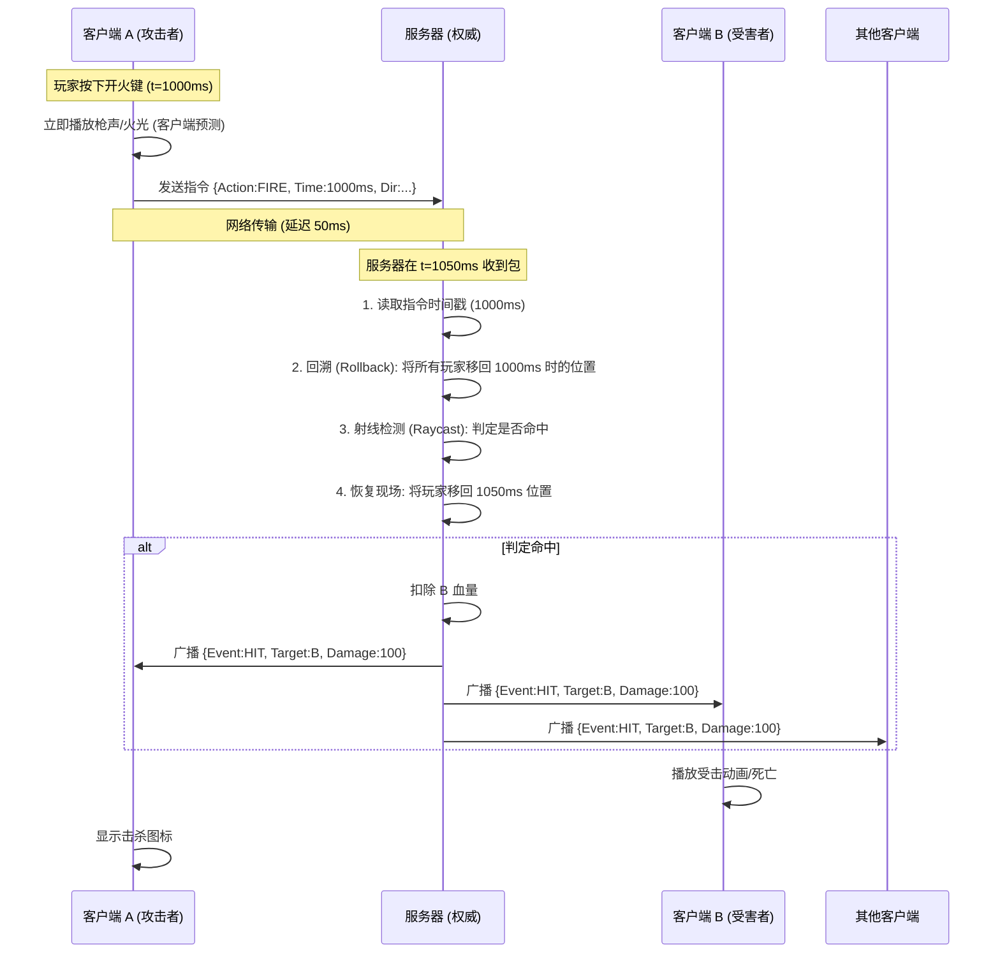
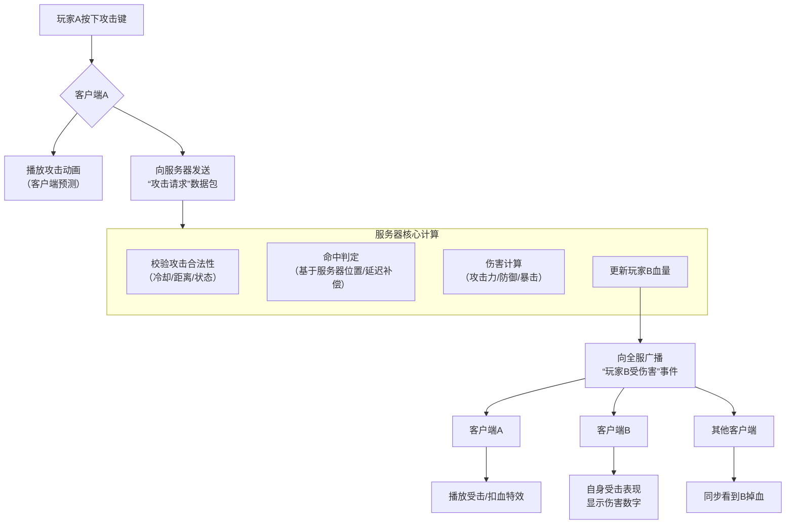
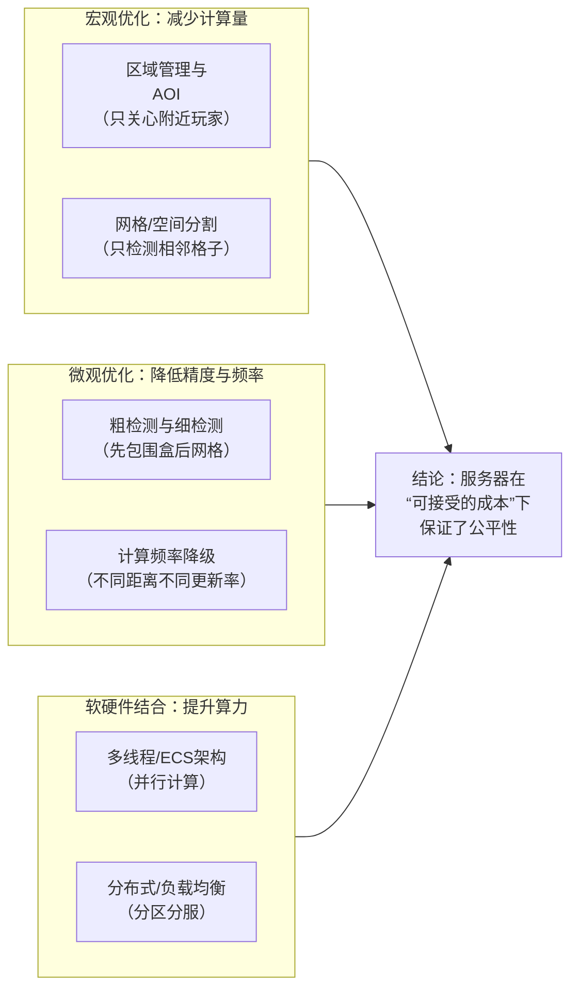

# FPS 核心技术：延迟补偿与 Sub-tick 架构解析

本文档详细解析了 3D PVP 射击游戏中的核心同步技术，包括延迟补偿 (Lag Compensation)、CS2 的 Sub-tick 架构以及服务器性能优化策略。

## 1. 延迟补偿 (Lag Compensation) 流程

在网络延迟存在的情况下，如何保证“所见即所得”的射击体验？核心机制是服务器的**时间回溯**。

### 1.1 完整交互时序图

### 1.2 处理流程图

---

## 2. CS2 Sub-tick 架构解析

CS2 引入的 Sub-tick 技术是对传统 Tick-based 架构的重大革命，旨在消除 Tickrate (64/128) 带来的手感差异。

### 2.1 传统 vs Sub-tick

| 特性 | 传统 FPS (CS:GO) | CS2 (Sub-tick) |
| :--- | :--- | :--- |
| **输入精度** | 只能精确到 Tick (每 15.6ms) | 精确到**微秒级**时间戳 |
| **服务器视角** | "你在第 10 帧开了一枪" | "你在第 10 帧 + **3.14ms** 开了一枪" |
| **回溯逻辑** | 回溯到第 10 帧的整点位置 | 回溯到第 10 帧位置 + **3.14ms 的插值位移** |
| **射击体验** | 受 Tickrate 限制，可能有微小偏差 | **无限 Tick** 的判定精度 |

### 2.2 实现关键点
1.  **高精度协议**：客户端上报的包必须包含 `Ratio` (帧内偏移量) 或 `Microsecond Timestamp`。
2.  **连续物理模拟**：服务器必须支持在两个物理帧之间进行插值 (Interpolation)，构建出“不存在于任何 Tick 上”的中间状态。

---

## 3. 服务器性能优化策略

如何在保证权威计算（防作弊）的同时，承载大量玩家？需要宏观与微观的结合。

### 3.1 核心优化手段
*   **AOI (Area of Interest)**: 使用九宫格或四叉树算法，只对玩家视野内的实体进行同步和物理检测。
*   **LOD (Level of Detail)**: 远处的物体降低物理检测频率（如每秒只算 10 次），近处的物体全频率计算（每秒 60 次）。
*   **ECS 并行化**: 利用 EnTT 等框架，将无依赖的系统（如移动、回血）分散到多核 CPU 上并行执行。
