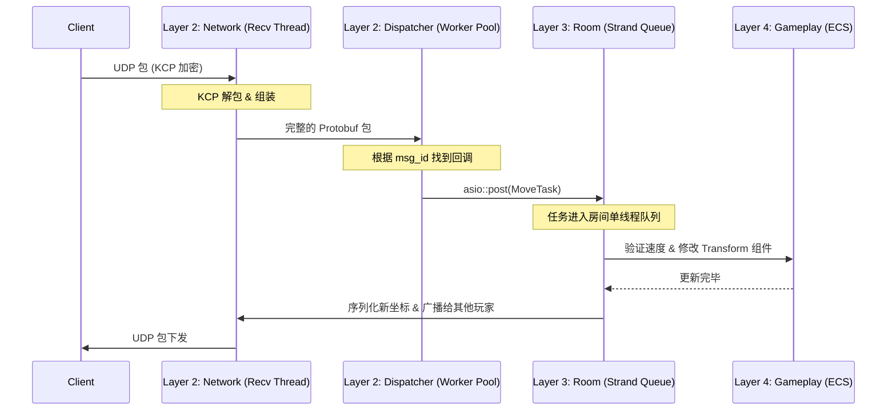

# 并发与内存管理模型 (Concurrency & Memory)

为了避免 C++ 常见的死锁、野指针和性能瓶颈，所有业务代码必须遵循以下动态规范。

## 1. 并发与多线程模型 (Concurrency)

本项目采用 **"多线程收发网络 + 单线程/Strand 执行房间逻辑"** 的模型。

*   **网络收发 (无锁设计)**：`recv_thread` 和 `update_thread` 负责底层的 UDP 接收和 KCP Tick。`SessionManager` 内部使用了分片锁 (`shards_`)，**业务代码不要直接操作 SessionManager**。
*   **业务逻辑执行 (Actor 模式/Strand)**：
    *   为了避免 `std::mutex` 满天飞导致的死锁，**同一个 `Room` 的所有逻辑更新必须在同一个线程或 ASIO Strand 中串行执行**。
    *   当 `Dispatcher` 收到玩家的移动包时，**不能在回调中直接修改坐标**。必须通过 `asio::post(room->strand(), ...)` 将任务派发到该房间专属的执行队列中。
    *   **禁忌**：严禁在业务逻辑中调用 `std::this_thread::sleep_for` 或执行同步数据库查询，这会阻塞整个工作线程。

## 2. 内存与对象生命周期 (Memory Management)

游戏服务器中对象生成销毁极度频繁，必须严格控制指针：

*   **智能指针原则**：
    *   跨模块持有长期对象（如 `Room` 级持有 `Player`），使用 `std::shared_ptr`。
    *   网络层回调中捕获 Session，必须使用 `std::weak_ptr`，并在使用前 `lock()` 检查是否存活，**严防玩家断线后导致的悬空指针 (Dangling Pointer)**。
*   **ECS 数据原则**：
    *   在 Gameplay 层，**坚决不使用指针**。玩家、怪物、子弹都是 `EnTT` 中的一个 `uint32_t` (Entity ID)。
    *   如果需要引用另一个实体，只保存其 `Entity ID`，而不是保存 `Entity*`。
*   **高频对象 (如子弹)**：严禁使用 `new/delete`。必须由 `EnTT` 的内存池管理，或自己实现 `ObjectPool`。

## 3. 核心业务时序流 (Workflow)

以下是一个典型的“玩家移动同步”的完整数据流向：

**关键点说明**：网络层 (N/D) 负责解包后，立刻通过 `asio::post` 把控制权交接给引擎层 (R)。这保证了即使有 1000 个玩家同时发包，房间内的数据修改绝对是线程安全且无锁的。
