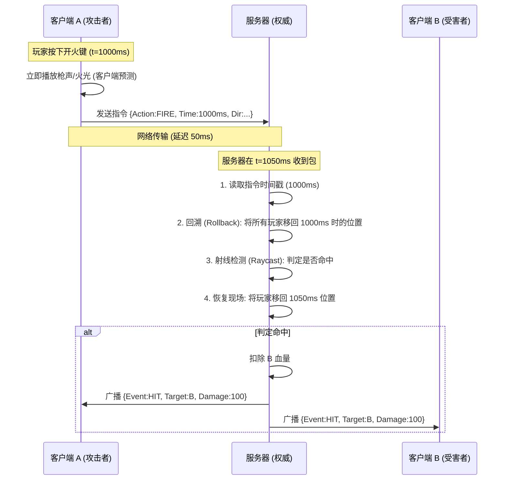

# 战斗判定与延迟补偿 (Combat & Lag Compensation)

本文档详细解析了 3D PVP 射击游戏中的核心同步技术，包括延迟补偿 (Lag Compensation)、CS2 的 Sub-tick 架构以及服务器性能优化策略。

## 1. 伤害判定模型 (Damage Model)

### 1.1 基础伤害公式
服务器权威计算伤害，公式如下：
```cpp
FinalDamage = (BaseDamage * DistanceFactor * BodyPartFactor) - ArmorReduction
```

*   **BaseDamage**: 武器基础伤害 (配置表)。
*   **DistanceFactor**: 距离衰减系数。
    *   例如：`0-10m: 1.0`, `10-50m: 0.8`, `>50m: 0.5`。
*   **BodyPartFactor**: 部位系数。
    *   `Head`: 4.0 (爆头)
    *   `Chest`: 1.0
    *   `Stomach`: 1.25
    *   `Legs`: 0.75
*   **ArmorReduction**: 护甲减免 (如 `ArmorValue * 0.5`)。

### 1.2 ECS 与 Jolt 集成
伤害判定系统 (`CombatSystem`) 依赖 Jolt Physics 进行精确检测。

```cpp
// 伪代码：CombatSystem 处理开火请求
void CombatSystem::handle_fire(entt::registry& registry, FireRequest& req) {
    // 1. 获取开火者位置和朝向
    auto& transform = registry.get<Transform>(req.shooter_id);
    
    // 2. 延迟补偿回溯 (Rollback)
    lag_compensation_sys.rollback_world(req.timestamp);
    
    // 3. Jolt 射线检测
    JPH::RayCast ray(transform.pos, req.direction * weapon.range);
    JPH::RayCastResult hit;
    if (physics_system.CastRay(ray, hit)) {
        // 4. 获取命中实体
        entt::entity target = physics_system.GetEntity(hit.BodyID);
        
        // 5. 判定命中部位 (通过 SubShapeID 映射骨骼)
        float part_factor = get_body_part_factor(hit.SubShapeID);
        
        // 6. 扣血
        apply_damage(target, weapon.damage * part_factor);
    }
    
    // 7. 恢复现场 (Restore)
    lag_compensation_sys.restore_world();
}
```

## 2. 延迟补偿 (Lag Compensation) 流程

在网络延迟存在的情况下，如何保证“所见即所得”的射击体验？核心机制是服务器的**时间回溯**。

### 2.1 完整交互时序图



## 3. CS2 Sub-tick 架构解析

CS2 引入的 Sub-tick 技术旨在消除 Tickrate (64/128) 带来的手感差异。

### 3.1 传统 vs Sub-tick

| 特性 | 传统 FPS (CS:GO) | CS2 (Sub-tick) |
| :--- | :--- | :--- |
| **输入精度** | 只能精确到 Tick (每 15.6ms) | 精确到**微秒级**时间戳 |
| **服务器视角** | "你在第 10 帧开了一枪" | "你在第 10 帧 + **3.14ms** 开了一枪" |
| **回溯逻辑** | 回溯到第 10 帧的整点位置 | 回溯到第 10 帧位置 + **3.14ms 的插值位移** |
| **射击体验** | 受 Tickrate 限制，可能有微小偏差 | **无限 Tick** 的判定精度 |

### 3.2 实现关键点
1.  **高精度协议**：客户端上报的包必须包含 `Ratio` (帧内偏移量) 或 `Microsecond Timestamp`。
2.  **连续物理模拟**：服务器必须支持在两个物理帧之间进行插值 (Interpolation)，构建出“不存在于任何 Tick 上”的中间状态。

## 4. 服务器性能优化策略

*   **AOI (Area of Interest)**: 使用九宫格或四叉树算法，只对玩家视野内的实体进行同步和物理检测。
*   **LOD (Level of Detail)**: 远处的物体降低物理检测频率（如每秒只算 10 次），近处的物体全频率计算（每秒 60 次）。
*   **ECS 并行化**: 利用 EnTT 等框架，将无依赖的系统（如移动、回血）分散到多核 CPU 上并行执行。
