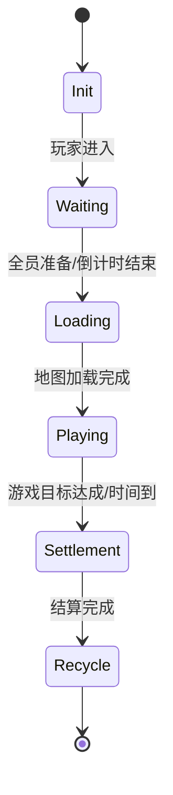

# 游戏循环与房间生命周期 (Game Loop & Room Lifecycle)

## 1. 房间生命周期 (Room Lifecycle)

房间 (Room) 是战斗逻辑的承载单元，其状态机如下：

*   **Init**: 分配房间 ID，初始化物理世界 (`Jolt Physics System`)。
*   **Waiting**: 等待玩家连接 (`SessionManager` 关联 Session 到 Room)。
*   **Loading**: 广播地图种子，等待客户端反馈 `LoadComplete`。
*   **Playing**: **核心战斗阶段**。执行 ECS 系统和物理模拟。
*   **Settlement**: 停止物理模拟，统计战绩，上传至 Golang 业务服。
*   **Recycle**: 踢出所有玩家，释放物理世界内存，归还对象池。

## 2. 核心 Tick 循环 (The Tick Loop)

服务器主循环维持固定频率 (如 60Hz, dt=16.6ms)，严格按序执行：

1.  **Network Recv**: 从 `SessionManager` 的输入队列提取所有玩家的操作指令 (`Cmd`)。
2.  **Pre-Update**:
    *   处理玩家加入/离开。
    *   应用玩家输入 (Input Prediction)。
3.  **Physics Simulate**:
    *   `JoltPhysics->Optimize()`
    *   `PhysicsSystem->Step(dt)`: 执行物理步进。
4.  **ECS Logic Update**:
    *   `MovementSystem`: 更新位置。
    *   `SkillSystem`: 冷却与技能释放。
    *   `CombatSystem`: 判定伤害与血量。
5.  **Post-Update**:
    *   脏数据标记 (Dirty Flag)。
    *   生成快照 (Snapshot Generation)。
6.  **Network Send**:
    *   将快照序列化，通过 KCP 广播给房间内所有玩家。

## 3. 线程模型 (Threading Model)

遵循 **Actor 模型** 或 **Strand 模型**：

*   **Main/Worker Threads**: 网络 I/O (收发包)。
*   **Room Strand**: **每个房间独占一个 Strand**。
    *   保证房间内的 `Physics` 和 `ECS` 逻辑是**单线程串行**的，无需加锁。
    *   不同房间可并行执行在不同线程上。

## 4. 异常处理
*   **Crash**: 房间逻辑异常需捕获，避免拖垮整个进程。
*   **Stuck**: 监控 Tick 耗时，若超过 `dt` (16ms) 需报警 (Lag Spike)。
