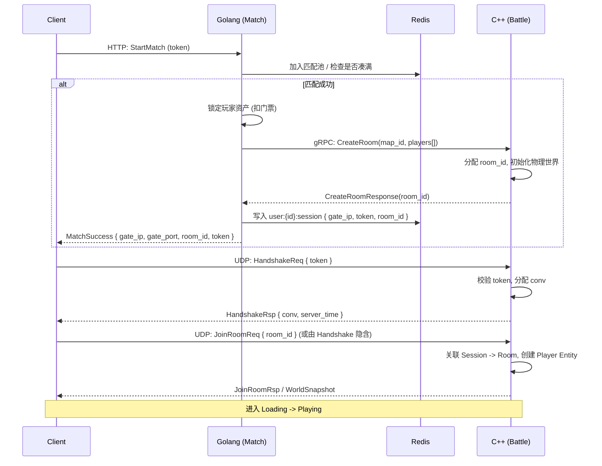

# 匹配与房间创建流程 (Matchmaking & Room Flow)

本文档描述从玩家点击「开始匹配」到进入战斗房间的端到端流程，涉及 Golang 与 C++ 的协作。

## 1. 参与方

*   **Client**：Unity/UE 客户端
*   **Golang (go-server)**：匹配服务、账号、经济
*   **C++ (cpp-server)**：战斗房间、Tick、物理

## 2. 时序图

## 3. 状态与约束

| 阶段 | Golang | C++ |
| :--- | :--- | :--- |
| 匹配中 | 维护匹配池，凑满即创建房间 | 无 |
| CreateRoom 后 | 等待 C++ 返回 room_id | 分配 Room，状态 Init→Waiting |
| 玩家连接 | 不感知 | 通过 Handshake 校验 token，关联 Session |
| 全员就绪 | 不感知 | Loading→Playing，开始 Tick |

## 4. 异常处理

| 场景 | 处理 |
| :--- | :--- |
| CreateRoom 失败 (C++ 满负荷) | Golang 返回匹配失败，退还门票 |
| 玩家 Handshake 超时 | C++ 等待 N 秒后释放 Slot；Golang 通过心跳检测可提前踢人 |
| 战斗中途 C++ 崩溃 | Golang 心跳超时，退还门票，记录日志 |
