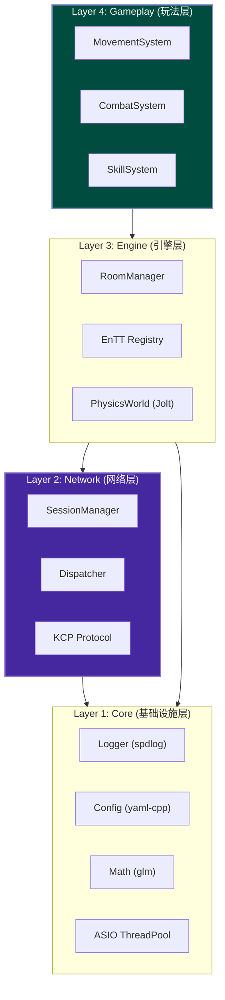

# 系统分层与微服务职责 (System Layering & Microservices)

## 1. 语言分工：C++ 与 Golang 的微服务联动

采用 **C++ (核心战斗)** + **Golang (外围业务)** 的混合架构是业界主流方案（如腾讯、网易大型项目）。

### 1.1 C++ Server (cpp-server)

**定位**：**CPU 密集型 + 强实时**。负责游戏内的每一帧计算。

- **核心战斗循环 (Tick Loop)**：维持固定帧率（如 60Hz/128Hz）的逻辑驱动。
- **物理与碰撞**：
  - **射线检测 (Raycast)**：用于判定远程武器（狙击、步枪）是否命中。
  - **碰撞检测 (Collision)**：用于处理近战攻击、手雷爆炸范围、角色移动阻挡。
- **网络同步**：
  - **状态同步/帧同步**：计算服务器权威状态，通过 KCP 下发 Snapshot 或 Delta。
  - **延迟补偿 (Lag Compensation)**：回滚世界状态历史快照，解决高 Ping 玩家“瞄准了打不中”的问题。
- **视野管理 (AOI)**：计算九宫格/四叉树，只向玩家同步其视野范围内的实体。

### 1.2 Golang Server (go-server)

**定位**：**I/O 密集型 + 弱实时**。负责与数据库、Web 前端交互。
*   **接入层**：账号注册、登录鉴权 (HTTP/HTTPS)、JWT Token 生成。
*   **局外经济 (Meta Economy)**：商城购买、背包管理、皮肤库存（读写 MySQL/Redis）。**涉及真金白银的逻辑必须在此层处理**。
*   **匹配系统 (Matchmaking)**：基于 ELO 分数的匹配池，组队逻辑。
*   **社交系统**：好友、聊天、公会、排行榜。
*   **资源调度**：当匹配成功后，通过 RPC 通知 C++ Server 创建房间，并将玩家分配过去。

**通信方式**：内网服务间推荐使用 **gRPC** 或 **Redis Pub/Sub**。

## 2. 架构分层原则 (Layered Architecture)

为了防止项目后期代码腐化和重复造轮子，C++ 端必须严格遵守以下分层原则。**能用成熟库，绝不手写。**

- **Layer 1 (Core)**: 纯工具，不依赖任何上层业务。
- **Layer 2 (Network)**: 负责收发包。**严禁**包含游戏逻辑（如“扣血”、“移动判定”）。收到包后应抛出 Event 或调用 Engine 层接口。
- **Layer 3 (Engine)**: 负责对象生命周期、物理世界 Tick、房间管理。它是连接网络与玩法的桥梁。
- **Layer 4 (Gameplay)**: 纯 ECS System。只关心数据变换（如 `Health -= Damage`）。
